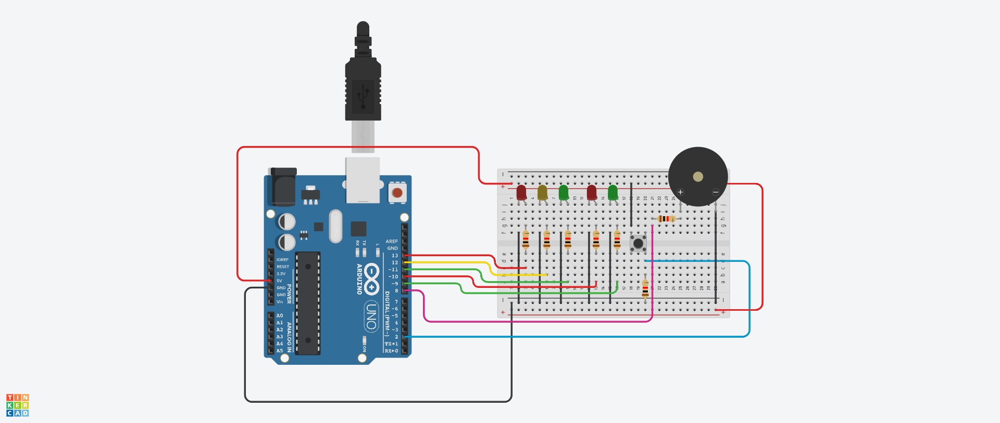

# Arduino Pedestrian Crossing Traffic Light System

This project implements a pedestrian crossing traffic light system using Arduino. The system consists of two traffic lights for vehicles and one for pedestrians, along with a push button for pedestrians to request crossing.

## Components Used

- Arduino board
- Push button
- LEDs (for traffic lights)
- Buzzer (for pedestrian signal)

## Installation

1. Connect the components according to the provided circuit diagram.
2. Upload the provided Arduino code to your Arduino board using the Arduino IDE or any compatible software.
3. Ensure all connections are secure.

## Usage

1. When the system is idle, the vehicle lights (typically red and green) will be on, and the pedestrian light will be off.
2. When a pedestrian presses the push button, the pedestrian light will turn on (typically green) after a delay, indicating it's safe to cross. Simultaneously, a buzzer signal will sound to alert pedestrians.
3. Meanwhile, the vehicle lights will switch to red, signaling vehicles to stop.
4. After a designated time, the pedestrian light will switch back to red, indicating it's no longer safe to cross.
5. The vehicle lights will then switch back to green, and the cycle repeats.

## Circuit Diagram

## Contributing

Contributions are welcome! Feel free to open an issue or submit a pull request with any improvements or suggestions.

## License

This project is licensed under the [MIT License](LICENSE).
